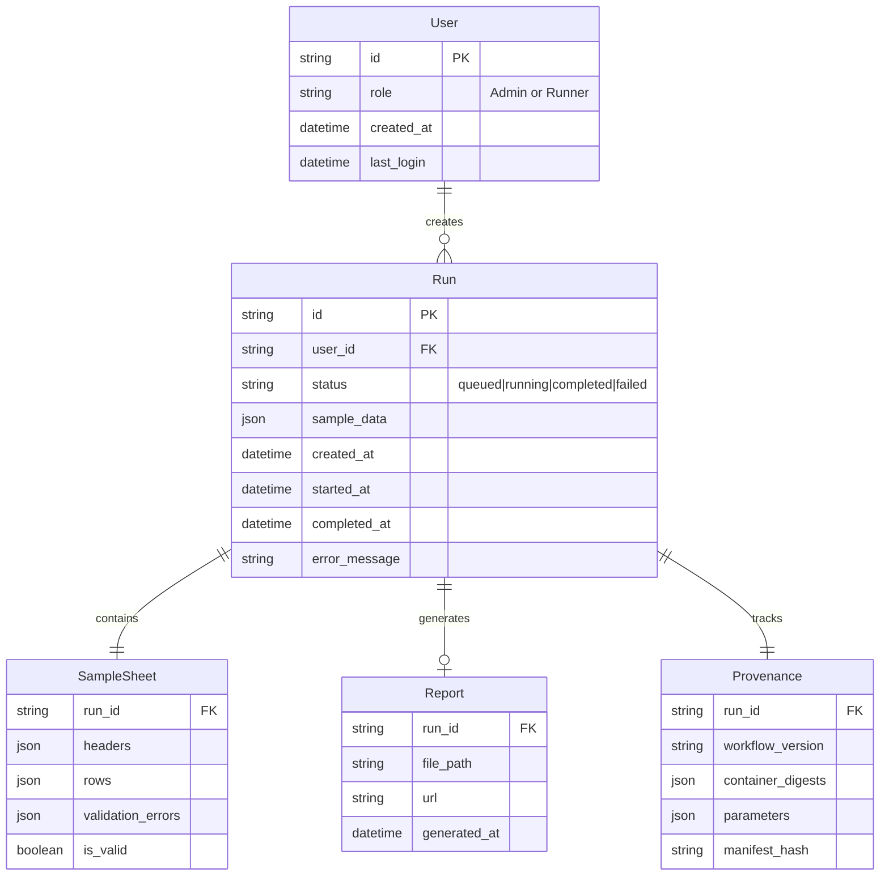

# Data Model Specification

**Feature**: RNA-seq Workflow Runner
**Date**: 2025-10-02
**Status**: Complete

## Entity Relationship Diagram



## Entity Specifications

### User
Represents system users with role-based access control.

**Fields**:
- `id` (string, PK): Unique identifier (UUID or username)
- `role` (enum): "Admin" or "Runner"
- `created_at` (datetime): Account creation timestamp
- `last_login` (datetime): Most recent login timestamp

**Validation Rules**:
- Role must be either "Admin" or "Runner"
- ID must be unique across system

**State Transitions**:
- Created → Active (on first login)
- Active → Active (on subsequent logins)

### Run
Core entity representing a workflow execution instance.

**Fields**:
- `id` (string, PK): Unique run identifier (UUID)
- `user_id` (string, FK): Creator's user ID
- `status` (enum): Current execution state
- `sample_data` (json): Complete CSV data snapshot
- `created_at` (datetime): Run creation timestamp
- `started_at` (datetime, nullable): Execution start time
- `completed_at` (datetime, nullable): Execution end time
- `error_message` (string, nullable): Failure reason if applicable

**Validation Rules**:
- Status must be one of: queued, running, completed, failed
- started_at must be >= created_at
- completed_at must be >= started_at
- error_message only populated when status = failed

**State Transitions**:
```
queued → running → completed
       ↘         ↗
         failed
```

### SampleSheet
Validated CSV data associated with a run.

**Fields**:
- `run_id` (string, FK): Associated run ID
- `headers` (json): Array of header names
- `rows` (json): Array of row objects
- `validation_errors` (json): Array of error objects with row/column info
- `is_valid` (boolean): Overall validation status

**Validation Rules**:
- Headers must be exactly: ["sample_id", "group", "read1_uri", "read2_uri"]
- All sample_id values must be unique
- All URI values must end with .fastq.gz
- Maximum 12 data rows
- Files at URI paths must exist with read permissions

**Example Structure**:
```json
{
  "headers": ["sample_id", "group", "read1_uri", "read2_uri"],
  "rows": [
    {
      "sample_id": "S001",
      "group": "control",
      "read1_uri": "/data/S001_R1.fastq.gz",
      "read2_uri": "/data/S001_R2.fastq.gz"
    }
  ],
  "validation_errors": [],
  "is_valid": true
}
```

### Report
Generated HTML report from workflow execution.

**Fields**:
- `run_id` (string, FK): Associated run ID
- `file_path` (string): Server filesystem path
- `url` (string): Public access URL
- `generated_at` (datetime): Report creation timestamp

**Validation Rules**:
- One report per run maximum
- File must exist at file_path
- URL must be accessible

**Lifecycle**:
- Created when run completes successfully
- Auto-deleted after 30 days (with parent run)

### Provenance
Immutable execution metadata for reproducibility.

**Fields**:
- `run_id` (string, FK): Associated run ID
- `workflow_version` (string): Pinned workflow version
- `container_digests` (json): Map of container names to sha256 digests
- `parameters` (json): Complete execution parameters
- `manifest_hash` (string): SHA256 of entire manifest

**Validation Rules**:
- All fields immutable after creation
- Container digests must be sha256 format
- Workflow version must be semantic version

**Example Structure**:
```json
{
  "workflow_version": "1.0.0",
  "container_digests": {
    "rnaseq": "sha256:abc123...",
    "multiqc": "sha256:def456..."
  },
  "parameters": {
    "reference": "GRCh38",
    "aligner": "STAR",
    "trimmer": "fastp"
  },
  "manifest_hash": "sha256:789xyz..."
}
```

## Database Schema (SQLite)

```sql
-- Users table
CREATE TABLE users (
    id TEXT PRIMARY KEY,
    role TEXT NOT NULL CHECK(role IN ('Admin', 'Runner')),
    created_at TIMESTAMP DEFAULT CURRENT_TIMESTAMP,
    last_login TIMESTAMP
);

-- Runs table
CREATE TABLE runs (
    id TEXT PRIMARY KEY,
    user_id TEXT NOT NULL,
    status TEXT NOT NULL CHECK(status IN ('queued', 'running', 'completed', 'failed')),
    sample_data JSON NOT NULL,
    created_at TIMESTAMP DEFAULT CURRENT_TIMESTAMP,
    started_at TIMESTAMP,
    completed_at TIMESTAMP,
    error_message TEXT,
    FOREIGN KEY (user_id) REFERENCES users(id)
);

-- Sample sheets table
CREATE TABLE sample_sheets (
    run_id TEXT PRIMARY KEY,
    headers JSON NOT NULL,
    rows JSON NOT NULL,
    validation_errors JSON,
    is_valid BOOLEAN NOT NULL,
    FOREIGN KEY (run_id) REFERENCES runs(id) ON DELETE CASCADE
);

-- Reports table
CREATE TABLE reports (
    run_id TEXT PRIMARY KEY,
    file_path TEXT NOT NULL,
    url TEXT NOT NULL,
    generated_at TIMESTAMP DEFAULT CURRENT_TIMESTAMP,
    FOREIGN KEY (run_id) REFERENCES runs(id) ON DELETE CASCADE
);

-- Provenance table
CREATE TABLE provenance (
    run_id TEXT PRIMARY KEY,
    workflow_version TEXT NOT NULL,
    container_digests JSON NOT NULL,
    parameters JSON NOT NULL,
    manifest_hash TEXT NOT NULL,
    FOREIGN KEY (run_id) REFERENCES runs(id) ON DELETE CASCADE
);

-- Sessions table for auth
CREATE TABLE sessions (
    id TEXT PRIMARY KEY,
    user_id TEXT NOT NULL,
    created_at TIMESTAMP DEFAULT CURRENT_TIMESTAMP,
    expires_at TIMESTAMP NOT NULL,
    FOREIGN KEY (user_id) REFERENCES users(id)
);

-- Index for performance
CREATE INDEX idx_runs_user_id ON runs(user_id);
CREATE INDEX idx_runs_status ON runs(status);
CREATE INDEX idx_runs_created_at ON runs(created_at);
CREATE INDEX idx_sessions_expires ON sessions(expires_at);
```

## Data Retention Policy

- Runs and all associated data auto-delete after 30 days from completion
- Implement daily cleanup job to remove expired runs
- Sessions expire after 24 hours of inactivity

## Access Control Matrix

| Entity | Admin | Runner |
|--------|-------|--------|
| Create Run | ✓ | ✓ |
| View Own Runs | ✓ | ✓ |
| View All Runs | ✓ | ✓ |
| Cancel Run | ✓ | ✗ |
| Delete Run | ✓ | ✗ |
| Re-run | ✓ | ✓ |

## Migration Strategy

For v0, initialize empty database with schema.
Future versions will require migration scripts using Alembic or similar.